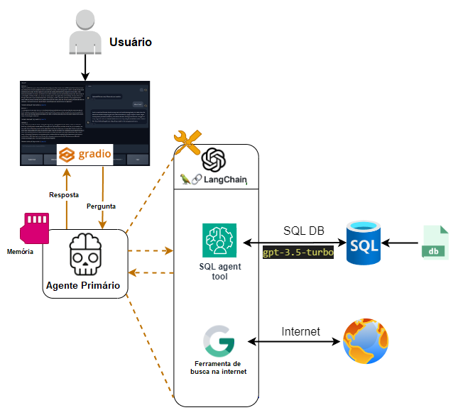
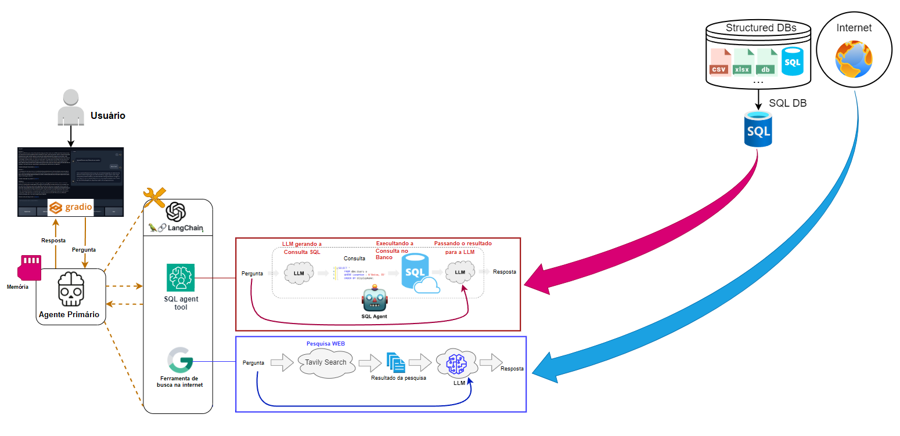
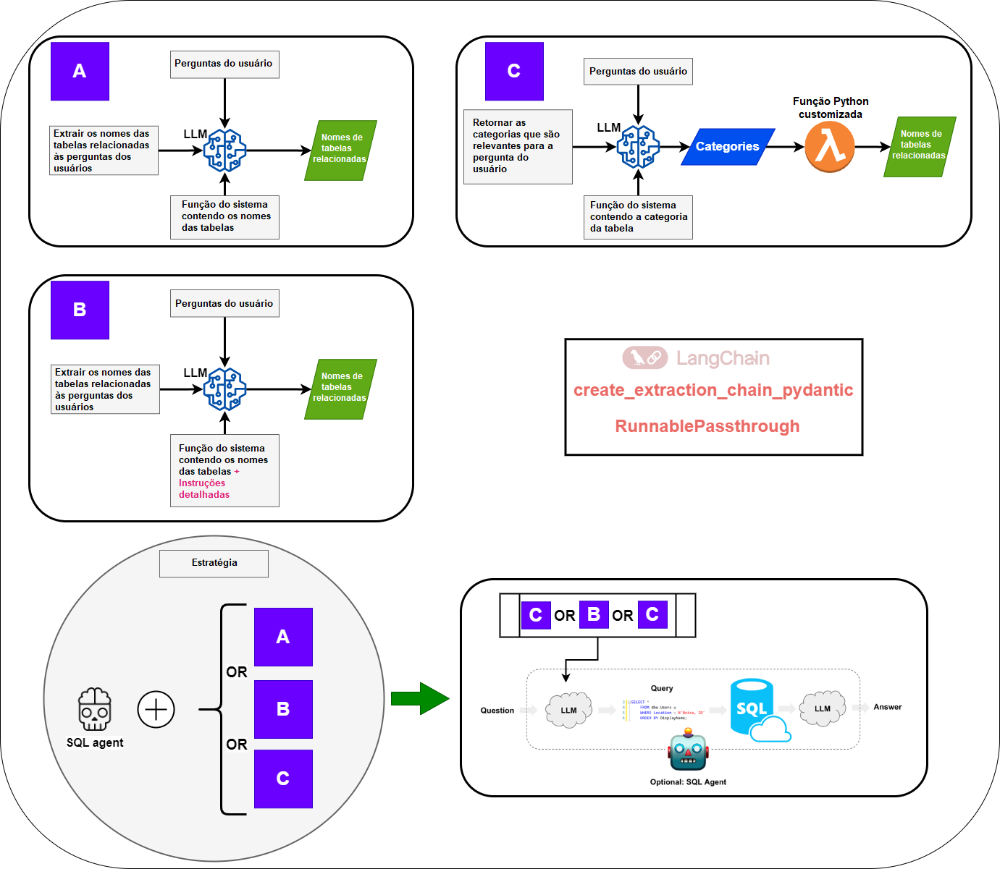
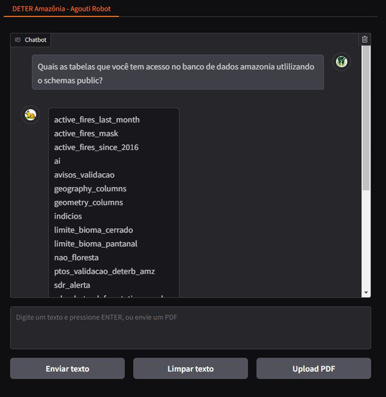
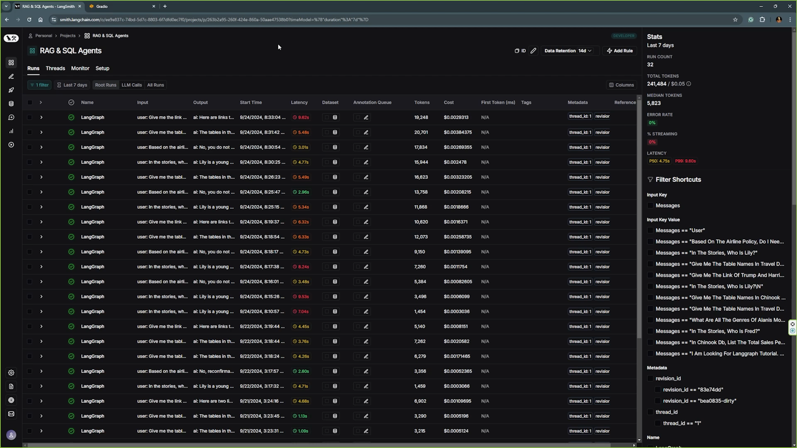

---

# Chatbot com Inteligência Artificial para o Banco de Dados do projeto DETER Amazônia

Este projeto demonstra como construir um sistema de agente usando Large Language Models (LLMs) que utiliza uma base de dados em Postgres. Ele destaca o uso de agentes SQL para consultar bancos de dados grandes de forma eficiente. As principais estruturas usadas neste projeto incluem OpenAI, LangChain, LangGraph, LangSmith e Gradio. O produto final é um chatbot de ponta a ponta, projetado para executar essas tarefas, com o LangSmith usado para monitorar o desempenho dos agentes.

---

## Requisitos

- **Sistema operacional:** Linux ou Windows (testado no Windows 11 com Python 3.9.11)
- **Chave de API OpenAI:** necessária para a funcionalidade GPT.
- **Credenciais Tavily:** necessárias para ferramentas de pesquisa (grátis no seu perfil Tavily).
- **Credenciais LangChain:** necessárias para LangSmith (grátis no seu perfil LangChain).
- **Dependências:** as bibliotecas necessárias são fornecidas no arquivo `requirements.txt`.
---

## Instalação e execução

Para configurar o projeto, siga estas etapas:

1. Clone o repositório:
```bash
git clone https://github.com/thiagonishimura/Chatbot_DETER_Amazonia.git
```
2. Instale o Python e crie um ambiente virtual:
```bash
python -m venv venv
```
3. Ative o ambiente virtual:
- No Windows:
```bash
venv\Scripts\activate
```
- No Linux/macOS:
```bash
source venv/bin/activate
```
4. Instale as dependências necessárias:
```bash
pip install -r requirements.txt
```

5. Prepare o arquivo `.env` e adicione seu `OPEN_AI_API_KEY`, `TAVILY_API_KEY` e `LANGCHAIN_API_KEY` e as configurações do seu Banco de dados.

6. Execute o aplicativo:
```bash
python src\app.py
```
Abra a URL do Gradio gerada no terminal e comece a conversar.

*Perguntas de exemplo estão disponíveis em `exemplo_perguntas.txt`.*

---

### Usando seu próprio banco de dados Postgres

Para usar seus próprios dados:
1. Abra o arquivo `.env`.
2. Copie as seguintes informações e cole-as dentro do arquivo `.env`:
```bash
   POSTGRES_DB_HOST=localhost ou IP do servidor
   POSTGRES_DB_PORT=5432 (Padrão) ou coloque a porta que esteja utilizando
   POSTGRES_DB_NAME=nome_do_banco
   POSTGRES_DB_USER=usuario_do_banco
   POSTGRES_DB_PASSWORD=senha_do_banco
```
4. Carregue as configurações em `src\agent_graph\load_tools_config.py`.

Todas as configurações são gerenciadas por meio de arquivos YAML na pasta `configs`, carregada por `src\chatbot\load_config.py` e `src\agent_graph\load_tools_config.py`. Esses módulos são usados ​​para uma distribuição limpa de configurações em todo o projeto.

Quando seus bancos de dados estiverem prontos, você pode conectar os agentes atuais aos bancos de dados ou criar novos agentes.

---

## Esquemas de Projeto

### Visão geral de alto nível

<div align="center">

</div>

### Esquema Detalhado

<div align="center">

</div>

### Esquema de Gráfico

<div align="center">

</div>

### Agente SQL para estratégias de grandes bancos de dados

<div align="center">

</div>

---

## Interface de Usuário do Chatbot

<div align="center">

</div>

---

## Sistema de monitoramento LangSmith

<div align="center">

</div>

---

## Banco de dado usado

- **Banco de dados SQL do projeto DETER Amazônia:**
---

## Principais estruturas e bibliotecas

- **LangChain:** [Introdução](https://python.langchain.com/docs/get_started/introduction)
- **LangGraph**
- **LangSmith**
- **Gradio:** [Documentação](https://www.gradio.app/docs/interface)
- **OpenAI:** [Início rápido do desenvolvedor](https://platform.openai.com/docs/quickstart?context=python)
- **Tavily Search**
---
